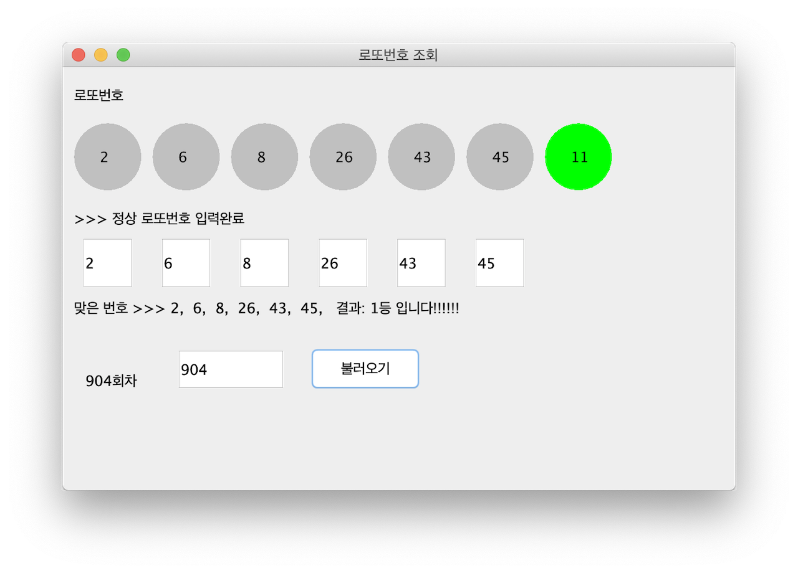
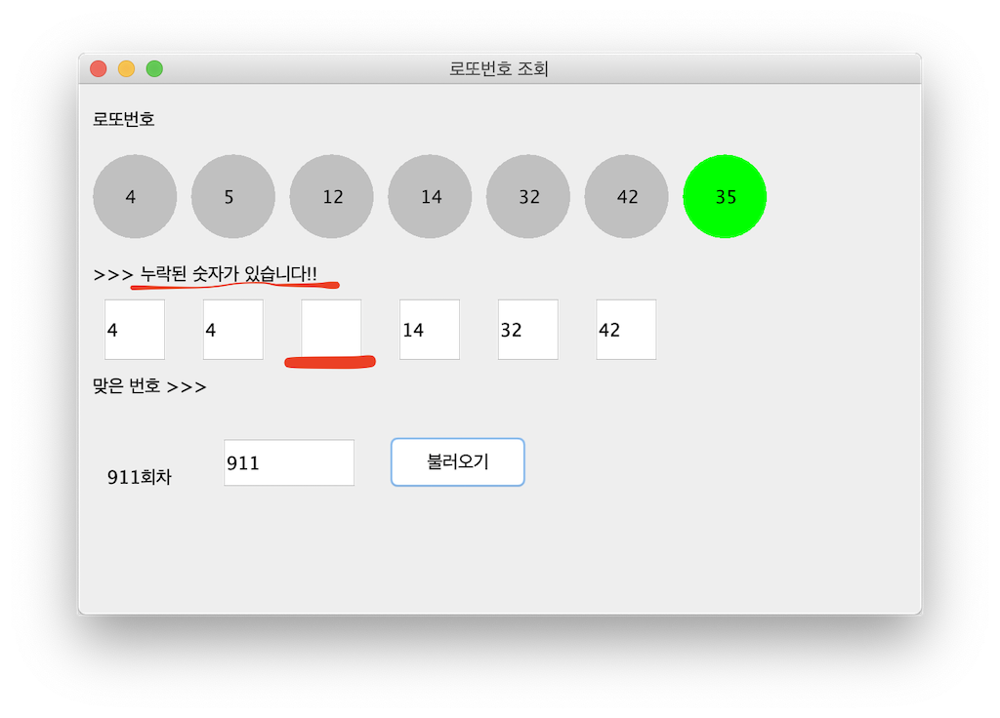
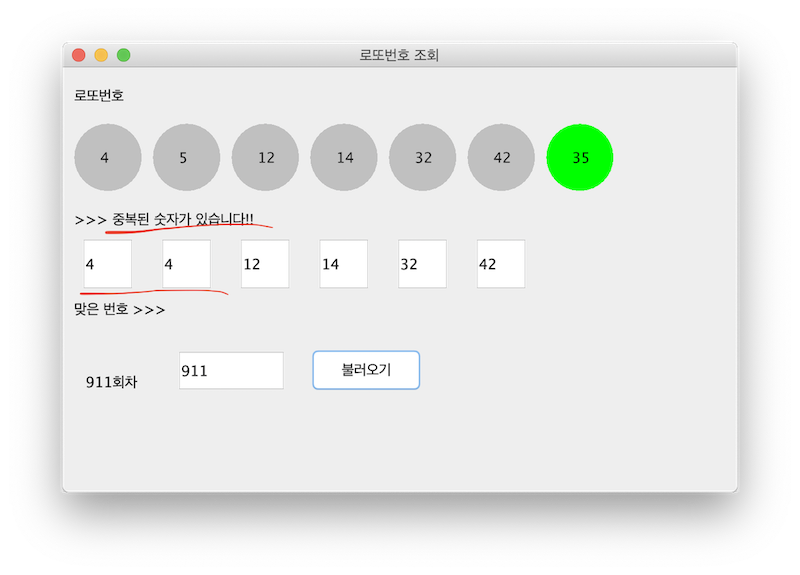
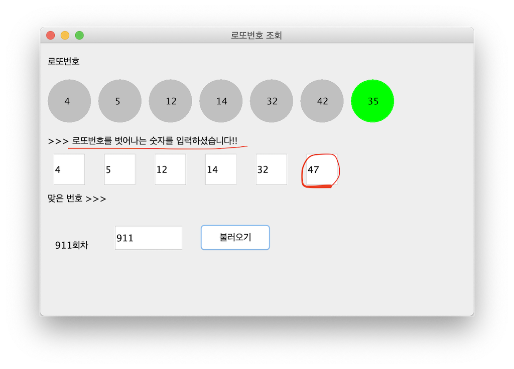

# 로또당첨 조회 프로그램
Check your Lotto6/45 numbers

나눔로또 6/45 회차조회 및 당첨결과를 확인 할 수 있는 프로그램입니다.

## 1. 로또번호 유효성 체크기능

입력한 로또번호가 올바른 번호의 조합인지 미리 검증한 뒤 당첨결과를 출력함으로써, 사용자의 번호 입력 오기로 인한 잘못된 결과출력을 미연에 방지합니다.

### 1. 누락 검증
---
누락된 번호가 있을시 메시지를 출력합니다.

### 2. 중복번호 검증
---
똑같은 번호가 2개 이상 존재시 메시지를 출력합니다.

### 3. 로또번호 범위 검증
---
로또번호는 1 ~ 45의 범위를 가집니다. 입력한 숫자가 이 범위를 벗어나지 않는지 검증합니다.

### 4. 숫자 외 입력 검증
---
숫자 이외의 문자나 기호를 입력했을시 메시지를 출력합니다.

## 2. 개발환경

+ SDK: Oracle JDK 1.8.0_242
+ IDE: eclipse 2019-12
+ 외부 라이브러리: json-simple-1.1.1.jar source from: https://github.com/fangyidong/json-simple

